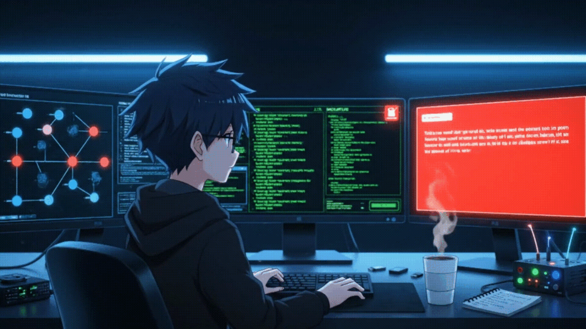
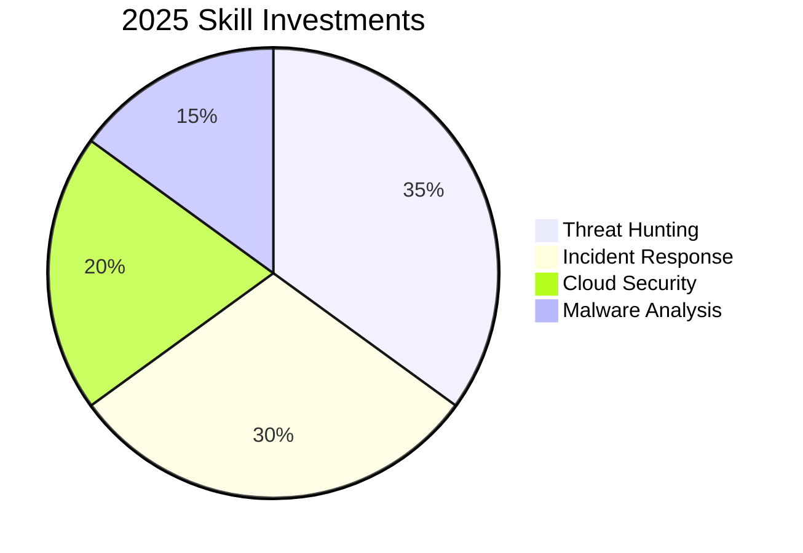

<!-- Header GIF -->

  

<!-- Main Heading -->
<h1 align="center">
   
  Hey there! I'm Chandraprakash C
</h1>

<!-- Typing Animation -->

  

<!-- Profile Views -->

  

<!-- About Me Section -->
## 🚀 About Me  
- 🎓 **B.Sc. Computer Science** student specializing in **Cybersecurity**  
- 🔭 Currently building **[SenSIEM](https://github.com/chandruthehacker/SenSIEM)** — an open-source SIEM & IDS  
- 🌱 Learning **Cloud Security (AWS/Azure)**, **Malware Analysis**, and **Threat Intelligence**  
- 👯 Open to collaborating on **Blue Team tools**, **Security Automation**, and **SOC-related projects**  
- 📝 Writing about security on **[Medium](https://medium.com/@chandruthehacker)**  
- 💬 Ask me about **Cybersecurity, Threat Detection, and Ethical Hacking**  
- 📫 Reach me at **cyberchandru87@gmail.com**  
- 🎯 Long-term goal: **Build an AI-powered threat defense startup**  

 

<h3 align="left">Connect with me:</h3>

<!-- Quick Links -->
### 🌐 [Visit My Portfolio Website](https://chandruthehacker.github.io/)  
### 📂 [View My Portfolio Repo](https://github.com/chandruthehacker/portfolio)

## 🌟 Featured Project: SenSIEM
> A full-stack log analysis & intrusion detection platform inspired by enterprise SIEM tools.

| Feature | Description |
|---------|-------------|
| 🔎 **Search Interface** | Splunk-style log search with custom filters |
| 📊 **Dashboards** | Real-time charts for alerts, IPs, and log types |
| 🚨 **Alerting Engine** | Detects brute-force, anomalies, suspicious behavior |
| 📬 **Notifications** | Email, Slack, and Telegram alert delivery |
| ⚙️ **Settings Panel** | Manage log paths, rules, and alerts |
| 🔁 **Log Forwarder** | Real-time log shipping from multiple sources |

🛠 **Tech Stack:** FastAPI • React • SQLite • Tailwind CSS • Recharts  
🔗 **[View on GitHub](https://github.com/chandruthehacker/SenSIEM)**

---

### 🛡️ My Arsenal: Skills & Tools

My toolkit is constantly evolving. Here's a snapshot of the technologies I work with daily.

#### **SIEM & Threat Detection**

  
  
  
  
  
  

#### **Automation & Scripting**

  
  
  

#### **Development & Cloud**

  
  
  
  
  
  

---

## 📊 GitHub Stats

  
  

---

## 🏅 Certifications & Achievements
- ✅ Google Cybersecurity Professional Certificate (Coursera)  
- 🛠 Certified Wazuh Engineer *(In Progress)*  
- 🎯 Preparing for CompTIA CySA+ (2025)  

---

## 🎯 2025 Focus Areas

---
> Open to: SOC Internships • Threat Research Collaborations • CTF Teams
---
> 🔐 *"Cybersecurity is not just a skill, it’s a responsibility."* — **Chandraprakash C (chandruthehacker)**
