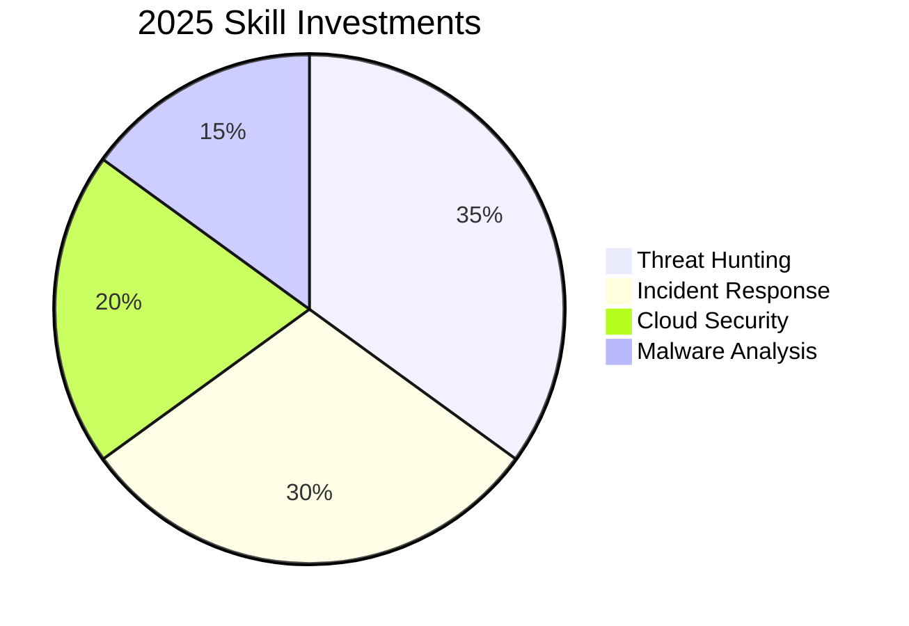

<h1 align="center">
   
  Hi, I'm Chandraprakash C (chandruthehacker)
</h1>
<h3 align="center">🔐 Aspiring Security Analyst | 🛡️ Cybersecurity Enthusiast | 🚀 Future Cyber Startup Builder</h3>

  
  
  
  

---

### 🌐 [Visit My Portfolio](https://chandruthehacker.github.io/)

---

  

### 🚀 **About Me**
- 🎓 **B.Sc Computer Science** student with focus on Cybersecurity
- 🔭 **Currently:** Building AI-powered security tools and contributing to open-source
- 🌱 **Learning:** Cloud Security (AWS/Azure), Malware Analysis, and Threat Intelligence
- 💡 **Passionate** about Blue Team operations and security automation
- ✍️ **Blogger** sharing knowledge on [Medium](https://medium.com/@chandruthehacker)
- 🎯 **Goal:** To build a cybersecurity startup focused on AI-driven threat detection

---

### 🛡️ **Defensive Security Stack**
#### 🔍 **Threat Detection**

| Category      | Tools                           |
|---------------|----------------------------------|
| **SIEM**      | Wazuh, Splunk, ELK Stack         |
| **IDS/IPS**   | Suricata, Snort                  |
| **EDR**       | OSSEC, Wazuh                     |
| **Threat Intel** | MISP, AlienVault OTX          |

#### ⚙️ Security Automation

| Category             | Tools                               |
|----------------------|--------------------------------------|
| **Scripting**        | Python, Bash, PowerShell             |
| **Log Parsing**      | Regex, GROK                          |
| **Orchestration**    | TheHive, Cortex                      |

#### 📜 Frameworks & Standards

| Standards & Frameworks                          |
|-------------------------------------------------|
| MITRE ATT&CK, NIST CSF, Cyber Kill Chain        |
| PCI DSS, ISO 27001                              |

---

### 🚨 Active Projects

| Project                       | Description                                 | Tools                      |
|------------------------------|---------------------------------------------|----------------------------|
| 🔒 Wazuh Rule Optimizer       | Custom rules reducing false positives by 20% | Wazuh, YARA                |
| 📡 Network Traffic Analyzer   | Detecting C2 traffic with Suricata           | Suricata, Zeek             |
| 📝 Sigma Rule Generator       | Converting IOC feeds to Sigma rules          | Python, Sigma              |
| 🛡️ Active Directory Hardening | PowerShell scripts for AD security           | PowerShell, BloodHound     |

---

### 📊 Security Metrics

   

---

### 🏆 Certifications & Achievements
- ✅ Google Cybersecurity Certificate (Coursera)
- ✅ Certified Wazuh Engineer (In Progress)
- 🔜 Planned: CompTIA CySA+ (2025)

--- 

### 🎯 2025 Focus Areas

---

### 💬 Get In Touch

    

---

> Defense is not just a job—it's a mindset
---
> Open to: SOC Internships • Threat Research Collaborations • CTF Teams

---

### 🛡️ Certifications

- 🟢 **Google Cybersecurity Professional Certificate** *(Completed)*  
- 🟡 **Internshala Ethical Hacking Training** *(Completed)*  
- 🔵 **IBM Cybersecurity Analyst Certificate** *(Planned)*

---

### 🧰 Tools, Languages & Tech Stack

  
  
  
  
  
  
  
  
  

---

### 🎯 2025 Roadmap

- ✅ Build 5+ cybersecurity tools (log parser, phishing detector, etc.)  
- ✅ Strengthen GitHub + Medium content for hiring visibility  
- 🛡️ Land a Security Analyst Internship  
- 🎤 Speak at cybersecurity events or college CTFs  
- 🔧 Contribute to open-source blue team tooling  
- 🚀 Prototype a real-time threat detection platform  

---

### 🌐 Connect With Me

  
  
  

---

> 🔐 *"Cybersecurity is not just a skill, it’s a responsibility."* — **Chandraprakash C (chandruthehacker)**
