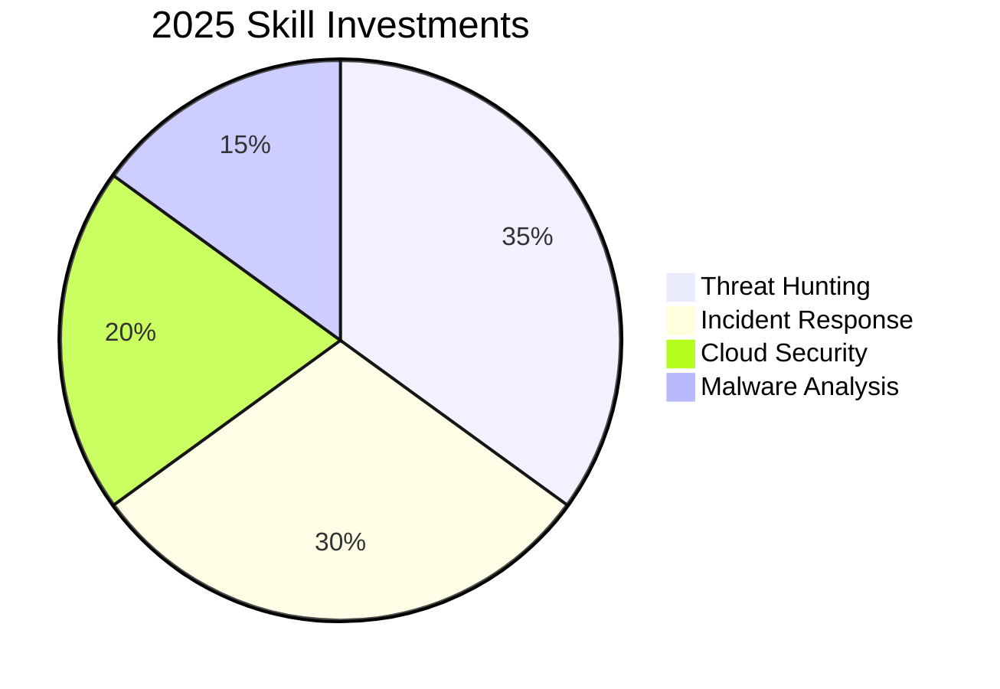

<h1 align="center">
   
  Hey there! I'm Chandraprakash C (chandruthehacker)
</h1>
<h3 align="center">🔐 Aspiring Security Analyst | 🛡️ Cybersecurity Enthusiast | 🧠 Blue Team Learner</h3>

  
  
  
  

<h3 align="center">Connect with me:</h3>

---

  
 

---

### 🌐 [Visit My Portfolio Website](https://chandruthehacker.github.io/)
### 🌐 [Visit My Portfolio Repo](https://github.com/chandruthehacker/portfolio)

---

  

# 🚀 About Me

- 🎓 I’m pursuing **B.Sc. Computer Science** with a specialization in **Cybersecurity**  
- 🔭 I’m currently working on **[SenSIEM](https://github.com/chandruthehacker/SenSIEM)** — an open-source SIEM solution  
- 🌱 I’m currently learning **Cloud Security (AWS/Azure), Malware Analysis, and Threat Intelligence**  
- 👯 I’m looking to collaborate on **Blue Team projects, security automation, and open-source security tools**  
- 👨‍💻 All of my projects are available at **[chandruthehacker.github.io](http://chandruthehacker.github.io/)**  
- 💬 Ask me about **Cybersecurity, Ethical Hacking, Threat Detection, and Security Automation**  
- 📫 How to reach me: **cyberchandru87@gmail.com**  

---

### 🌟 **Featured Project: SenSIEM – Open Source SIEM & IDS**

> A full-stack log analysis and intrusion detection system that mimics real-world SIEM tools.

| Feature | Description |
|--------|-------------|
| 🔎 **Search Interface** | Splunk-style log search with custom filters |
| 📊 **Dashboards** | Real-time charts for alerts, sources, IPs, and log types |
| 🚨 **Alerting Engine** | Detects brute-force, anomalies & suspicious behavior |
| 📬 **Notifications** | Sends alerts via Email, Slack, and Telegram |
| ⚙️ **Settings Panel** | Manage log paths, rules, and alert configs |
| 🔁 **Log Forwarder** | Cross-platform client for real-time log shipping |

> 🛠 Built with **FastAPI**, **React**, **SQLite**, **Tailwind CSS**, **Recharts**  
> ***🔗 [View Project on GitHub](https://github.com/chandruthehacker/SenSIEM)***

---

### 🛡️ **Defensive Security Stack**
#### 🔍 **Threat Detection**

| Category      | Tools                           |
|---------------|----------------------------------|
| **SIEM**      | Wazuh, Splunk, ELK Stack, **SenSIEM** |
| **IDS/IPS**   | Suricata, Snort                  |
| **EDR**       | OSSEC, Wazuh                     |
| **Threat Intel** | MISP, AlienVault OTX          |

#### ⚙️ Security Automation

| Category             | Tools                               |
|----------------------|--------------------------------------|
| **Scripting**        | Python, Bash, PowerShell             |
| **Log Parsing**      | Regex, GROK                          |
| **Orchestration**    | TheHive, Cortex                      |

#### 📜 Frameworks & Standards

| Standards & Frameworks                          |
|-------------------------------------------------|
| MITRE ATT&CK, NIST CSF, Cyber Kill Chain        |
| PCI DSS, ISO 27001                              |

---

### 🧪 **Active Projects**

| Project                       | Description                                 | Tools                      |
|------------------------------|---------------------------------------------|----------------------------|
| 🔐 **SenSIEM**               | Full-stack SIEM for log analysis & alerts    | FastAPI, React, SQLite     |
| 📡 Network Traffic Analyzer   | Detecting C2 traffic with Suricata           | Suricata, Zeek             |
| 📝 Sigma Rule Generator       | Converting IOC feeds to Sigma rules          | Python, Sigma              |
| 🛡️ AD Hardening Toolkit       | PowerShell scripts for securing AD           | PowerShell, BloodHound     |

---

### 📊 **Security Metrics**

  
  

---

### 🏅 **Certifications & Achievements**
- ✅ Google Cybersecurity Professional Certificate (Coursera)
- ✅ Certified Wazuh Engineer *(In Progress)*
- 🎯 Upcoming: CompTIA CySA+ (2025)

---

### 🎯 **2025 Focus Areas**

---

### 💬 Get In Touch

    

---

> Defense is not just a job—it's a mindset
---
> Open to: SOC Internships • Threat Research Collaborations • CTF Teams
---
> 🔐 *"Cybersecurity is not just a skill, it’s a responsibility."* — **Chandraprakash C (chandruthehacker)**
